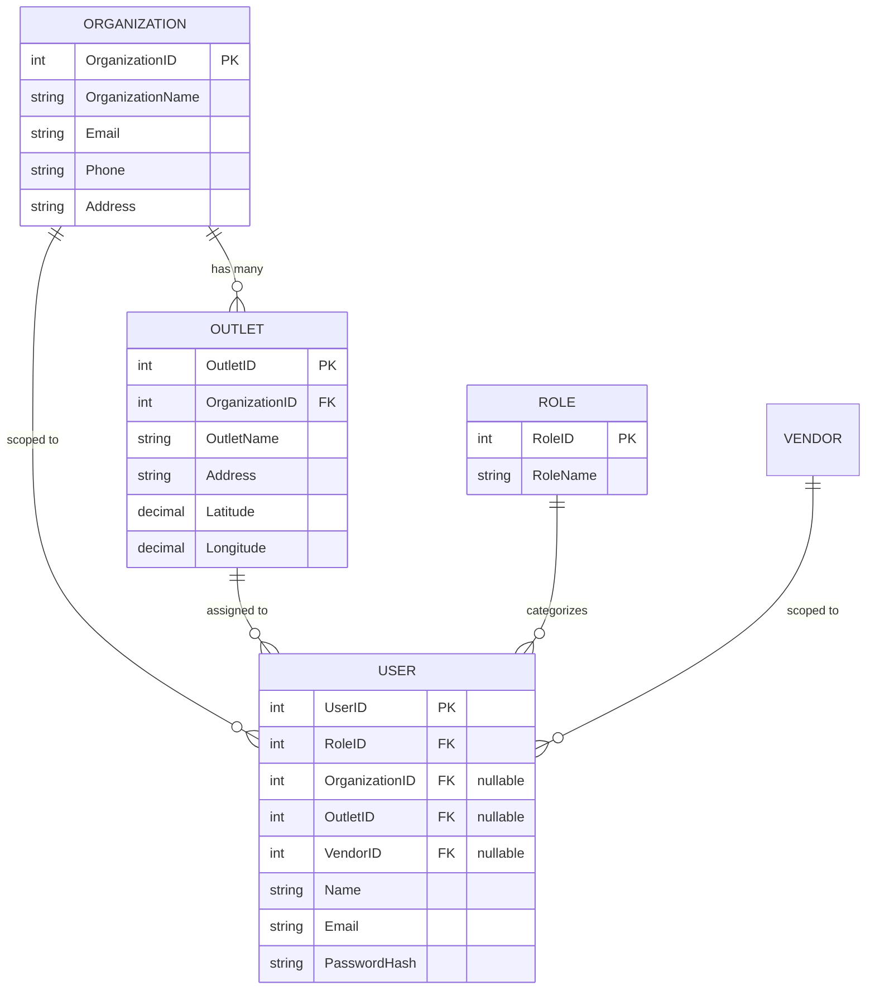
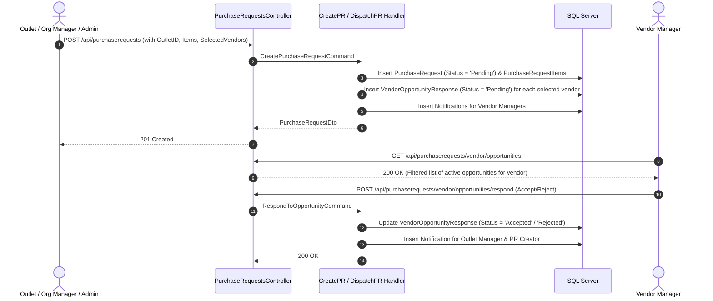
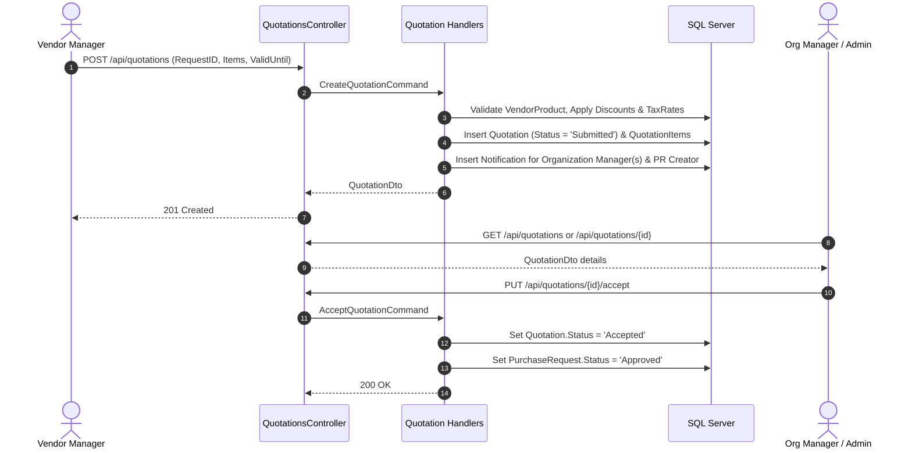
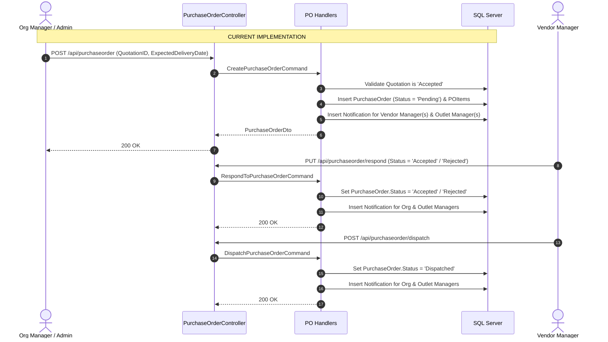
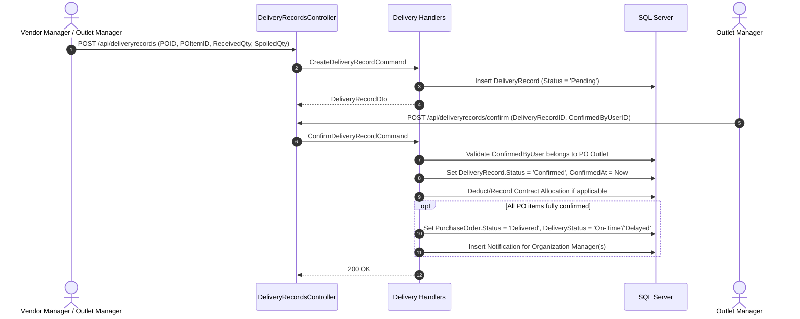
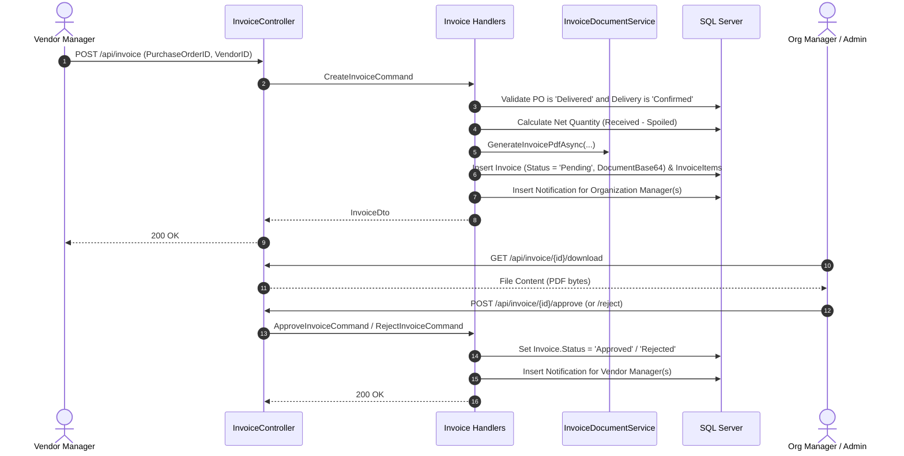
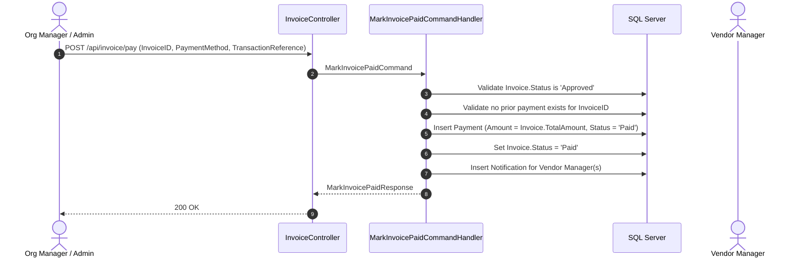
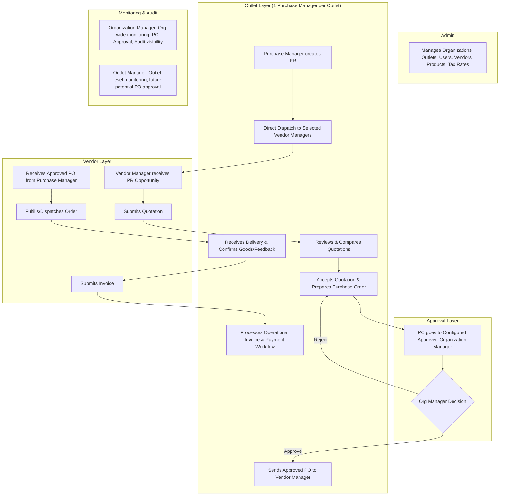

# COMPREHENSIVE BACKEND READ-ONLY AUDIT REPORT
**Smart Vendor Management & Procurement System**

---

### Executive Confirmation
- **Audit Mode**: Read-Only Inspection.
- **Files Modified**: **0** existing code files modified.
- **Database/Migrations**: **0** (No migrations added, updated, or applied; no schema or seed data touched).
- **Baseline Integrity**: Fully preserved.

---

## 1. ROLES AND AUTHENTICATION

### 1.1 Where Roles are Defined
1. **Domain Entity**:
   - [`Role.cs`](file:///c:/Users/NIHAR/Downloads/niback/backendvendorfinalbeforehack-master/Core/VendorManagementprojDomain/Entities/Role.cs): Properties `int RoleID`, `string RoleName`, `ICollection<User> Users`.
2. **Persistence Configuration**:
   - [`VendorManagementDbContext.cs:L117-129`](file:///c:/Users/NIHAR/Downloads/niback/backendvendorfinalbeforehack-master/VendorManagementprojPersistence/Data/VendorManagementDbContext.cs#L117-L129): Maps `Roles` table with unique constraint on `RoleName`.
3. **Database Seeding & Migration**:
   - [`Program.cs:L181-204`](file:///c:/Users/NIHAR/Downloads/niback/backendvendorfinalbeforehack-master/VendorManagementprojApi/Program.cs#L181-L204): Executes `context.Database.MigrateAsync()` on startup and seeds 4 roles if not present.
4. **Application Role Mappings**:
   - [`CreateUserCommandHandler.cs:L37-59`](file:///c:/Users/NIHAR/Downloads/niback/backendvendorfinalbeforehack-master/Core/VendorManagementprojApplication/Features/Discounts/Commands/CreateUser/CreateUserCommandHandler.cs#L37-L59) and [`UpdateUserCommandHandler.cs:L51-74`](file:///c:/Users/NIHAR/Downloads/niback/backendvendorfinalbeforehack-master/Core/VendorManagementprojApplication/Features/Users/Commands/UpdateUser/UpdateUserCommandHandler.cs#L51-L74).

### 1.2 Current Role Names and IDs
| Role ID | Role Name | Purpose / Scope |
| :--- | :--- | :--- |
| `1` | `Admin` | System-wide administrative privileges across all organizations, outlets, and vendors |
| `2` | `Organization Manager` | Organization-level procurement management, contract creation, invoice approval, and payments |
| `3` | `Outlet Manager` | Outlet-level operations, purchase requests, delivery receiving, and complaints |
| `4` | `Vendor Manager` | External supplier portal operations: product catalog, opportunity response, quotations, PO dispatch, invoice submission |

### 1.3 How Users are Associated with Roles
- [`User.cs`](file:///c:/Users/NIHAR/Downloads/niback/backendvendorfinalbeforehack-master/Core/VendorManagementprojDomain/Entities/User.cs): Foreign key `public int RoleID { get; set; }` referencing `Role.RoleID`.
- Navigation property `public Role? Role { get; set; }`.
- Eager-loaded via EF Core `.Include(u => u.Role)` in [`UserRepository.cs`](file:///c:/Users/NIHAR/Downloads/niback/backendvendorfinalbeforehack-master/VendorManagementprojPersistence/Repositories/UserRepository.cs).

### 1.4 How Current User & Role are Obtained
1. **Authentication Flow**: User submits credentials to [`AuthController.Login`](file:///c:/Users/NIHAR/Downloads/niback/backendvendorfinalbeforehack-master/VendorManagementprojApi/Controllers/AuthController.cs#L18-L28) -> [`LoginUserCommandHandler.cs`](file:///c:/Users/NIHAR/Downloads/niback/backendvendorfinalbeforehack-master/Core/VendorManagementprojApplication/Features/Users/Commands/LoginUser/LoginUserCommandHandler.cs).
2. **Token Generation**: [`JwtTokenService.GenerateToken(user)`](file:///c:/Users/NIHAR/Downloads/niback/backendvendorfinalbeforehack-master/VendorManagementprojApi/Services/JwtTokenService.cs#L19-L101) issues a JWT containing claims:
   - `UserID` (`user.UserID.ToString()`)
   - `ClaimTypes.Name` (`user.Name`)
   - `ClaimTypes.Email` (`user.Email`)
   - `ClaimTypes.Role` (`user.Role.RoleName`)
   - `OrganizationID` (optional `user.OrganizationID`)
   - `OutletID` (optional `user.OutletID`)
   - `VendorID` (optional `user.VendorID`)
3. **Claims Resolution at Runtime**: [`CurrentUserService.cs`](file:///c:/Users/NIHAR/Downloads/niback/backendvendorfinalbeforehack-master/VendorManagementprojApi/Services/CurrentUserService.cs) implementing [`ICurrentUserService.cs`](file:///c:/Users/NIHAR/Downloads/niback/backendvendorfinalbeforehack-master/Core/VendorManagementprojApplication/Contracts/Services/ICurrentUserService.cs) resolves claims from `IHttpContextAccessor.HttpContext.User`:
   - Properties: `UserID`, `Name`, `Email`, `Role`, `OrganizationID`, `OutletID`, `VendorID`.
   - Helper flags: `IsAdmin`, `IsOrganizationManager`, `IsOutletManager`, `IsVendorManager`.

### 1.5 How Authorization is Enforced
- **API Level**: ASP.NET Core `[Authorize(Roles = "...")]` attributes on controllers and specific endpoints.
- **Handler Level**: In MediatR handlers via `_currentUserService` (e.g. checking `_currentUserService.OrganizationID == outlet.OrganizationID` or `_currentUserService.VendorID == purchaseOrder.VendorID`).

### 1.6 Verification of "Purchase Manager"
- **Result**: **Does NOT exist**.
- Rigorous case-insensitive grep across all code, entities, migrations, and DTOs produced **0 results**.

---

## 2. ORGANIZATION / OUTLET / USER RELATIONSHIPS



### 2.1 Relationship Mechanics
- An **Organization** contains one or more **Outlets** ([`Outlet.cs`](file:///c:/Users/NIHAR/Downloads/niback/backendvendorfinalbeforehack-master/Core/VendorManagementprojDomain/Entities/Outlet.cs)).
- A **User** has nullable foreign keys to `OrganizationID`, `OutletID`, and `VendorID` ([`User.cs`](file:///c:/Users/NIHAR/Downloads/niback/backendvendorfinalbeforehack-master/Core/VendorManagementprojDomain/Entities/User.cs)).
- **Outlet Assignment**: Users are associated with an outlet by assigning `User.OutletID` (e.g., when Admin creates or updates a user via [`UsersController.Create`](file:///c:/Users/NIHAR/Downloads/niback/backendvendorfinalbeforehack-master/VendorManagementprojApi/Controllers/UsersController.cs#L55-L70)).
- **One Purchase Manager Per Outlet Concept**: **Currently MISSING**. Neither `Outlet` nor `User` has any configuration or constraint enforcing 1 Purchase Manager per outlet.

### 2.2 Key Files
- **Entities**: [`Organization.cs`](file:///c:/Users/NIHAR/Downloads/niback/backendvendorfinalbeforehack-master/Core/VendorManagementprojDomain/Entities/Organization.cs), [`Outlet.cs`](file:///c:/Users/NIHAR/Downloads/niback/backendvendorfinalbeforehack-master/Core/VendorManagementprojDomain/Entities/Outlet.cs), [`User.cs`](file:///c:/Users/NIHAR/Downloads/niback/backendvendorfinalbeforehack-master/Core/VendorManagementprojDomain/Entities/User.cs), [`Role.cs`](file:///c:/Users/NIHAR/Downloads/niback/backendvendorfinalbeforehack-master/Core/VendorManagementprojDomain/Entities/Role.cs).
- **Controllers**: [`OrganizationsController.cs`](file:///c:/Users/NIHAR/Downloads/niback/backendvendorfinalbeforehack-master/VendorManagementprojApi/Controllers/OrganizationsController.cs), [`OutletsController.cs`](file:///c:/Users/NIHAR/Downloads/niback/backendvendorfinalbeforehack-master/VendorManagementprojApi/Controllers/OutletsController.cs), [`UsersController.cs`](file:///c:/Users/NIHAR/Downloads/niback/backendvendorfinalbeforehack-master/VendorManagementprojApi/Controllers/UsersController.cs).
- **Repositories**: [`OrganizationRepository.cs`](file:///c:/Users/NIHAR/Downloads/niback/backendvendorfinalbeforehack-master/VendorManagementprojPersistence/Repositories/OrganizationRepository.cs), [`OutletRepository.cs`](file:///c:/Users/NIHAR/Downloads/niback/backendvendorfinalbeforehack-master/VendorManagementprojPersistence/Repositories/OutletRepository.cs), [`UserRepository.cs`](file:///c:/Users/NIHAR/Downloads/niback/backendvendorfinalbeforehack-master/VendorManagementprojPersistence/Repositories/UserRepository.cs).

---

## 3. PURCHASE REQUEST (PR) WORKFLOW



### 3.1 Flow Details
1. **Creation & Persistence**:
   - Endpoint: `POST /api/purchaserequests` ([`PurchaseRequestsController.cs:L123-143`](file:///c:/Users/NIHAR/Downloads/niback/backendvendorfinalbeforehack-master/VendorManagementprojApi/Controllers/PurchaseRequestsController.cs#L123-L143)).
   - Authorized Roles: `Admin`, `Organization Manager`, `Outlet Manager`.
   - Command: `CreatePurchaseRequestCommand`, Handler: [`CreatePurchaseRequestCommandHandler.cs`](file:///c:/Users/NIHAR/Downloads/niback/backendvendorfinalbeforehack-master/Core/VendorManagementprojApplication/Features/PurchaseRequests/Commands/CreatePurchaseRequest/CreatePurchaseRequestCommandHandler.cs).
   - Entity: `PurchaseRequest` created with `Status = "Pending"`, `RequestDate = DateTime.Now`.
2. **Vendor Opportunity Association & Dispatch**:
   - If `SelectedVendorIDs` or `SelectedVendorID` are provided in `CreatePurchaseRequestCommand` or via `POST /api/purchaserequests/{requestID}/dispatch` (`DispatchPurchaseRequestCommand`), the system creates `VendorOpportunityResponse` records (`Status = "Pending"`) and creates `Notification` records (`NotificationType = "ProcurementOpportunity"`) for each `Vendor Manager` user assigned to the selected vendor (`u.VendorID == vendorId`).
3. **Vendor Opportunity Response**:
   - `GET /api/purchaserequests/vendor/opportunities` ([`GetVendorProcurementOpportunitiesQueryHandler.cs`](file:///c:/Users/NIHAR/Downloads/niback/backendvendorfinalbeforehack-master/Core/VendorManagementprojApplication/Features/PurchaseRequests/Queries/GetVendorProcurementOpportunities/GetVendorProcurementOpportunitiesQueryHandler.cs)): Vendor Manager views matching opportunities where they have an active `VendorProduct` and were selected for the PR.
   - `POST /api/purchaserequests/vendor/opportunities/respond` ([`RespondToOpportunityCommandHandler.cs`](file:///c:/Users/NIHAR/Downloads/niback/backendvendorfinalbeforehack-master/Core/VendorManagementprojApplication/Features/PurchaseRequests/Commands/RespondToOpportunity/RespondToOpportunityCommandHandler.cs)): Vendor Manager accepts or rejects the opportunity. On response, notifications (`NotificationType = "OpportunityAccepted"` or `"OpportunityRejected"`) are dispatched to the assigned Outlet Manager and PR creator.
4. **Approval Requirement Analysis**:
   - **Current Behavior**: PR creation **does not require approval**. The PR directly creates vendor opportunities upon creation/dispatch.
   - **Future Requirement Comparison**: The future requirement ("Purchase Requests should NOT require manager approval; Purchase Manager creates PR and it goes directly to Vendor Manager") aligns with the current non-approval logic; the only difference is the creator role is currently Outlet Manager/Org Manager/Admin instead of Purchase Manager.

---

## 4. QUOTATION WORKFLOW



### 4.1 Flow Details
1. **Quotation Creation**:
   - Endpoint: `POST /api/quotations` ([`QuotationsController.cs:L58-81`](file:///c:/Users/NIHAR/Downloads/niback/backendvendorfinalbeforehack-master/VendorManagementprojApi/Controllers/QuotationsController.cs#L58-L81)).
   - Authorized Role: `Vendor Manager`.
   - Command: `CreateQuotationCommand`, Handler: [`CreateQuotationCommandHandler.cs`](file:///c:/Users/NIHAR/Downloads/niback/backendvendorfinalbeforehack-master/Core/VendorManagementprojApplication/Features/Quotations/Commands/CreateQuotation/CreateQuotationCommandHandler.cs).
   - Validates products are active for vendor, calculates line-item prices, discounts via [`DiscountRepository.GetActiveDiscountAsync`](file:///c:/Users/NIHAR/Downloads/niback/backendvendorfinalbeforehack-master/VendorManagementprojPersistence/Repositories/DiscountRepository.cs), and tax via [`TaxRateRepository`](file:///c:/Users/NIHAR/Downloads/niback/backendvendorfinalbeforehack-master/VendorManagementprojPersistence/Repositories/TaxRateRepository.cs).
   - Sets initial `Quotation.Status = "Submitted"`.
   - Sends notification (`NotificationType = "QuotationSubmitted"`) to Organization Manager(s) and PR creator.
2. **Quotation Retrieval & Comparison**:
   - `GET /api/quotations`: `Admin, Organization Manager, Vendor Manager`.
   - `GET /api/quotations/vendor/my`: `Vendor Manager`.
   - `GET /api/quotations/{id}`: `Admin, Organization Manager, Vendor Manager`.
   - Vendor analysis & recommendations supported via `VendorAnalysisController` and `VendorRecommendationsController`.
3. **Quotation Acceptance / Rejection**:
   - `PUT /api/quotations/{quotationID}/accept` ([`AcceptQuotationCommandHandler.cs`](file:///c:/Users/NIHAR/Downloads/niback/backendvendorfinalbeforehack-master/Core/VendorManagementprojApplication/Features/Quotations/Commands/AcceptQuotation/AcceptQuotationCommandHandler.cs)) and `PUT /api/quotations/{quotationID}/reject` / `PUT /api/quotations/respond`:
   - Authorized Roles: `Admin`, `Organization Manager`.
   - On Acceptance: `Quotation.Status` becomes `"Accepted"`, and linked `PurchaseRequest.Status` is updated to `"Approved"`.
4. **Link to Purchase Order**:
   - Acceptance does not automatically generate a PO.
   - An accepted quotation is the prerequisite for `CreatePurchaseOrderCommand` (`quotation.Status == "Accepted"`).

---

## 5. PURCHASE ORDER (PO) WORKFLOW



### 5.1 Detailed Inspection Findings
- **How PO is Created / Prepared**:
  - Endpoint: `POST /api/purchaseorder` ([`PurchaseOrderController.cs:L24-32`](file:///c:/Users/NIHAR/Downloads/niback/backendvendorfinalbeforehack-master/VendorManagementprojApi/Controllers/PurchaseOrderController.cs#L24-L32)).
  - Authorized Roles: `Admin`, `Organization Manager`.
  - Command: `CreatePurchaseOrderCommand`, Handler: [`CreatePurchaseOrderCommandHandler.cs`](file:///c:/Users/NIHAR/Downloads/niback/backendvendorfinalbeforehack-master/Core/VendorManagementprojApplication/Features/PurchaseOrders/Commands/CreatePurchaseOrder/CreatePurchaseOrderCommandHandler.cs).
  - Copies items, prices, discounts, and taxes directly from accepted `Quotation`.
- **Initial Status**: Starts at `Status = "Pending"`.
- **Approval Mechanism & Approver Configuration**:
  - **Does ANY internal PO approval mechanism currently exist?**: **NO**.
  - **Does PO approver configuration exist anywhere?**: **NO**. There are no approver ID fields, approval status fields, or approval rules in `Outlet`, `Organization`, or `PurchaseOrder`.
  - In current code, `Status = "Pending"` means **pending vendor response**, NOT internal management approval. The PO is dispatched directly to the Vendor Manager upon creation.
- **Vendor Response & Dispatch**:
  - Vendor responds via `PUT /api/purchaseorder/respond` ([`RespondToPurchaseOrderCommandHandler.cs`](file:///c:/Users/NIHAR/Downloads/niback/backendvendorfinalbeforehack-master/Core/VendorManagementprojApplication/Features/PurchaseOrders/Commands/RespondToPurchaseOrder/RespondToPurchaseOrderCommandHandler.cs)): Status -> `"Accepted"` or `"Rejected"`.
  - Vendor dispatches via `POST /api/purchaseorder/dispatch` ([`DispatchPurchaseOrderCommandHandler.cs`](file:///c:/Users/NIHAR/Downloads/niback/backendvendorfinalbeforehack-master/Core/VendorManagementprojApplication/Features/PurchaseOrders/Commands/DispatchPurchaseOrder/DispatchPurchaseOrderCommandHandler.cs)): Status -> `"Dispatched"`.
- **PO Status Values & Transitions**:
  `Pending` (Created, awaiting vendor) -> `Accepted` / `Rejected` (Vendor response) -> `Dispatched` (Vendor dispatch) -> `Delivered` (All deliveries confirmed).

---

## 6. DELIVERY / RECEIVING WORKFLOW



### 6.1 Flow Details
1. **Creation**:
   - Endpoint: `POST /api/deliveryrecords` ([`DeliveryRecordsController.cs:L24-31`](file:///c:/Users/NIHAR/Downloads/niback/backendvendorfinalbeforehack-master/VendorManagementprojApi/Controllers/DeliveryRecordsController.cs#L24-L31)).
   - Authorized Roles: `Admin`, `Vendor Manager`, `Outlet Manager`, `Organization Manager`.
   - Handler: [`CreateDeliveryRecordCommandHandler.cs`](file:///c:/Users/NIHAR/Downloads/niback/backendvendorfinalbeforehack-master/Core/VendorManagementprojApplication/Features/DeliveryRecords/Commands/CreateDeliveryRecord/CreateDeliveryRecordCommandHandler.cs).
   - Validates PO is `"Dispatched"`, calculates spoilage percentage, creates record with `Status = "Pending"`.
2. **Confirmation & Receiving**:
   - Endpoint: `POST /api/deliveryrecords/confirm` ([`DeliveryRecordsController.cs:L48-57`](file:///c:/Users/NIHAR/Downloads/niback/backendvendorfinalbeforehack-master/VendorManagementprojApi/Controllers/DeliveryRecordsController.cs#L48-L57)).
   - Authorized Roles: `Admin`, `Outlet Manager`.
   - Handler: [`ConfirmDeliveryRecordCommandHandler.cs`](file:///c:/Users/NIHAR/Downloads/niback/backendvendorfinalbeforehack-master/Core/VendorManagementprojApplication/Features/DeliveryRecords/Commands/ConfirmDeliveryRecord/ConfirmDeliveryRecordCommandHandler.cs).
   - Enforces user's `OutletID` matches `PurchaseOrder.OutletID`.
   - Updates `DeliveryRecord.Status = "Confirmed"`, sets `ConfirmedByUserID` and `ConfirmedAt`.
   - Tracks contract allocation usage against [`ContractVendorAllocation`](file:///c:/Users/NIHAR/Downloads/niback/backendvendorfinalbeforehack-master/Core/VendorManagementprojDomain/Entities/ContractVendorAllocation.cs) if an active contract exists.
   - When all PO items are fully confirmed: sets `PurchaseOrder.Status = "Delivered"`, computes `DeliveryStatus` (`"On-Time"` or `"Delayed by X days"`), and sends notification (`NotificationType = "PurchaseOrderDelivered"`) to Organization Manager(s).
3. **Goods Feedback & Quality Review**:
   - Supported via [`VendorFeedbackController.cs`](file:///c:/Users/NIHAR/Downloads/niback/backendvendorfinalbeforehack-master/VendorManagementprojApi/Controllers/VendorFeedbackController.cs) (`POST /api/vendorfeedback` - `Admin, Organization Manager, Outlet Manager`) and [`ComplaintsController.cs`](file:///c:/Users/NIHAR/Downloads/niback/backendvendorfinalbeforehack-master/VendorManagementprojApi/Controllers/ComplaintsController.cs) (`POST /api/complaints` - `Outlet Manager`).

---

## 7. INVOICE WORKFLOW



### 7.1 Detailed Inspection Findings
- **Invoice Submission**:
  - Endpoint: `POST /api/invoice` ([`InvoiceController.cs:L35-41`](file:///c:/Users/NIHAR/Downloads/niback/backendvendorfinalbeforehack-master/VendorManagementprojApi/Controllers/InvoiceController.cs#L35-L41)).
  - Authorized Roles: `Admin`, `Vendor Manager`.
  - Handler: [`CreateInvoiceCommandHandler.cs`](file:///c:/Users/NIHAR/Downloads/niback/backendvendorfinalbeforehack-master/Core/VendorManagementprojApplication/Features/Invoices/Commands/CreateInvoice/CreateInvoiceCommandHandler.cs).
  - Validation: PO must have `Status == "Delivered"`, and deliveries must have `Status == "Confirmed"`.
  - Line items derive net quantity as `ReceivedQuantity - SpoiledQuantity`.
  - Automatically renders a PDF via [`InvoiceDocumentService.cs`](file:///c:/Users/NIHAR/Downloads/niback/backendvendorfinalbeforehack-master/Core/VendorManagementprojApplication/Contracts/Services/InvoiceDocumentService.cs) and saves it as Base64 in `Invoice.InvoiceDocumentBase64`.
  - Initial Status: `Status = "Pending"`.
- **Notifications**:
  - Sends notification (`NotificationType = "InvoiceSubmitted"`) to all `Organization Manager` users matching `u.OrganizationID == outlet.OrganizationID`.
- **Viewing & PDF Download**:
  - `GET /api/invoice`: `Admin, Organization Manager, Vendor Manager, Outlet Manager`.
  - `GET /api/invoice/{id}`: `Admin, Organization Manager, Vendor Manager, Outlet Manager`.
  - `GET /api/invoice/{id}/download`: `Admin, Organization Manager, Vendor Manager, Outlet Manager` ([`InvoiceController.cs:L80-99`](file:///c:/Users/NIHAR/Downloads/niback/backendvendorfinalbeforehack-master/VendorManagementprojApi/Controllers/InvoiceController.cs#L80-L99)). Returns PDF byte stream with correct headers.
- **Approval / Rejection**:
  - `POST /api/invoice/{invoiceID}/approve` ([`ApproveInvoiceCommandHandler.cs`](file:///c:/Users/NIHAR/Downloads/niback/backendvendorfinalbeforehack-master/Core/VendorManagementprojApplication/Features/Invoices/Commands/ApproveInvoice/ApproveInvoiceCommandHandler.cs)) and `POST /api/invoice/{invoiceID}/reject`:
  - Authorized Roles: `Admin`, `Organization Manager`.
  - Updates `Invoice.Status` to `"Approved"` or `"Rejected"` and notifies Vendor Manager.

---

## 8. PAYMENT WORKFLOW



### 8.1 Detailed Inspection Findings
- **Who Can Pay / Process an Invoice**:
  - Endpoint: `POST /api/invoice/pay` ([`InvoiceController.cs:L101-107`](file:///c:/Users/NIHAR/Downloads/niback/backendvendorfinalbeforehack-master/VendorManagementprojApi/Controllers/InvoiceController.cs#L101-L107)).
  - Authorized Roles: `Admin`, `Organization Manager`.
  - Handler: [`MarkInvoicePaidCommandHandler.cs`](file:///c:/Users/NIHAR/Downloads/niback/backendvendorfinalbeforehack-master/Core/VendorManagementprojApplication/Features/Invoices/Commands/MarkInvoicePaid/MarkInvoicePaidCommandHandler.cs).
- **Payment Verification Rules**:
  - Strictly requires `Invoice.Status == "Approved"`.
  - Enforces duplicate payment prevention via [`PaymentRepository.GetByInvoiceIdAsync`](file:///c:/Users/NIHAR/Downloads/niback/backendvendorfinalbeforehack-master/VendorManagementprojPersistence/Repositories/PaymentRepository.cs).
  - Validates `PaymentMethod` in `["Bank Transfer", "UPI", "Cheque", "Cash"]`.
  - Server-derives `Payment.Amount` strictly from `Invoice.TotalAmount`.
  - Inserts [`Payment`](file:///c:/Users/NIHAR/Downloads/niback/backendvendorfinalbeforehack-master/Core/VendorManagementprojDomain/Entities/Payment.cs) record with `Status = "Paid"`, sets `Invoice.Status = "Paid"`.
  - Dispatches notification (`NotificationType = "PaymentReceived"`) to Vendor Manager(s).
- **Listing Payments**:
  - `GET /api/invoice/payments` ([`GetPaymentsQueryHandler.cs`](file:///c:/Users/NIHAR/Downloads/niback/backendvendorfinalbeforehack-master/Core/VendorManagementprojApplication/Features/Payments/Queries/GetPayments/GetPaymentsQueryHandler.cs)): `Admin, Organization Manager, Vendor Manager`.

---

## 9. NOTIFICATIONS ARCHITECTURE

### 9.1 Structure and Components
- **Domain Entity**: [`Notification.cs`](file:///c:/Users/NIHAR/Downloads/niback/backendvendorfinalbeforehack-master/Core/VendorManagementprojDomain/Entities/Notification.cs)
  - Fields: `NotificationID`, `UserID`, `RelatedRequestID`, `RelatedVendorID`, `Title`, `Message`, `NotificationType`, `IsRead`, `CreatedDate`, `User`.
- **Persistence**:
  - Interface: [`INotificationRepository.cs`](file:///c:/Users/NIHAR/Downloads/niback/backendvendorfinalbeforehack-master/Core/VendorManagementprojApplication/Contracts/Persistence/INotificationRepository.cs).
  - Implementation: [`NotificationRepository.cs`](file:///c:/Users/NIHAR/Downloads/niback/backendvendorfinalbeforehack-master/VendorManagementprojPersistence/Repositories/NotificationRepository.cs).
- **Controller**:
  - [`NotificationsController.cs`](file:///c:/Users/NIHAR/Downloads/niback/backendvendorfinalbeforehack-master/VendorManagementprojApi/Controllers/NotificationsController.cs)
  - `GET /api/notifications` -> [`GetMyNotificationsQueryHandler.cs`](file:///c:/Users/NIHAR/Downloads/niback/backendvendorfinalbeforehack-master/Core/VendorManagementprojApplication/Features/Notifications/Queries/GetMyNotifications/GetMyNotificationsQueryHandler.cs) (fetches notifications for `_currentUserService.UserID`).
  - `PUT /api/notifications/{id}/read` -> [`MarkNotificationAsReadCommandHandler.cs`](file:///c:/Users/NIHAR/Downloads/niback/backendvendorfinalbeforehack-master/Core/VendorManagementprojApplication/Features/Notifications/Commands/MarkNotificationAsRead/MarkNotificationAsReadCommandHandler.cs).

### 9.2 How Recipients are Selected
- Handlers query `IUserRepository.GetAllAsync()` and filter in-memory:
  - By `VendorID` & `RoleName == "Vendor Manager"`
  - By `OutletID` & `RoleName == "Outlet Manager"`
  - By `OrganizationID` & `RoleName == "Organization Manager"`
  - By direct user ID (e.g. `PurchaseRequest.CreatedByUserID`).
- Notifications are created per recipient user ID via `await _notificationRepository.AddAsync(new Notification { UserID = u.UserID, ... })`.

### 9.3 Reusability for Future Purchase Manager Role
- **Verdict**: **100% Reusable**. No new notification architecture or tables are needed. Handlers can query `IUserRepository` for users with `u.OutletID == outletId` and `u.Role.RoleName == "Purchase Manager"` and insert standard `Notification` rows.

---

## 10. CQRS / MEDIATR ARCHITECTURE

### 10.1 Request Flow Pattern
```
HTTP Client / Frontend
        │
        ▼
API Controller (Route & [Authorize(Roles = "...")] attributes)
        │
        ▼
MediatR (IMediator.Send(command/query))
        │
        ▼
Handler (IRequestHandler<TRequest, TResponse>)
   ├── Injects: ICurrentUserService, Repository Interfaces, Domain Services
   ├── Performs business rule validations & domain logic
   ├── Invokes Repositories (Entity Framework Core / SQL Server)
   ├── Dispatches notifications via INotificationRepository
   └── Returns DTO Response
        │
        ▼
API Controller converts response to IActionResult (Ok, CreatedAtAction, NotFound, BadRequest, etc.)
        │
        ▼
HTTP Response / JSON
```

### 10.2 CQRS Inventory by Domain Feature
| Feature Area | Commands | Queries | Primary Repositories Used |
| :--- | :--- | :--- | :--- |
| **Users / Auth** | `LoginUserCommand`, `CreateUserCommand`, `UpdateUserCommand`, `UpdateMyProfileCommand` | `GetAllUsersQuery`, `GetUserByIdQuery` | `IUserRepository` |
| **Organizations** | `CreateOrganizationCommand`, `UpdateOrganizationCommand`, `DeleteOrganizationCommand` | `GetAllOrganizationsQuery`, `GetOrganizationByIdQuery` | `IOrganizationRepository` |
| **Outlets** | `CreateOutletCommand`, `UpdateOutletCommand`, `DeleteOutletCommand` | `GetAllOutletsQuery`, `GetOutletByIdQuery`, `GetOutletsByOrganizationIdQuery` | `IOutletRepository`, `IOrganizationRepository` |
| **Purchase Requests** | `CreatePurchaseRequestCommand`, `UpdatePurchaseRequestCommand`, `DeletePurchaseRequestCommand`, `AddPurchaseRequestItemCommand`, `DeletePurchaseRequestItemCommand`, `DispatchPurchaseRequestCommand`, `RespondToOpportunityCommand` | `GetAllPurchaseRequestsQuery`, `GetPurchaseRequestByIdQuery`, `GetPurchaseRequestItemsQuery`, `GetVendorProcurementOpportunitiesQuery` | `IPurchaseRequestRepository`, `IOutletRepository`, `IProductRepository`, `IVendorOpportunityResponseRepository`, `INotificationRepository` |
| **Quotations** | `CreateQuotationCommand`, `UpdateQuotationCommand`, `DeleteQuotationCommand`, `AcceptQuotationCommand`, `RejectQuotationCommand`, `RespondToQuotationCommand` | `GetAllQuotationsQuery`, `GetQuotationByIdQuery`, `GetVendorQuotationsQuery` | `IQuotationRepository`, `IPurchaseRequestRepository`, `IVendorProductRepository`, `IDiscountRepository`, `ITaxRateRepository`, `INotificationRepository` |
| **Purchase Orders** | `CreatePurchaseOrderCommand`, `RespondToPurchaseOrderCommand`, `DispatchPurchaseOrderCommand` | `GetAllPurchaseOrdersQuery`, `GetPurchaseOrderByIdQuery`, `GetPendingPurchaseOrdersQuery` | `IPurchaseOrderRepository`, `IQuotationRepository`, `IPurchaseRequestRepository`, `INotificationRepository` |
| **Delivery Records** | `CreateDeliveryRecordCommand`, `ConfirmDeliveryRecordCommand` | `GetDeliveriesByPurchaseOrderQuery` | `IDeliveryRecordRepository`, `IPurchaseOrderRepository`, `IContractRepository`, `INotificationRepository` |
| **Invoices** | `CreateInvoiceCommand`, `ApproveInvoiceCommand`, `RejectInvoiceCommand`, `MarkInvoicePaidCommand` | `GetAllInvoicesQuery`, `GetInvoiceByIdQuery` | `IInvoiceRepository`, `IPurchaseOrderRepository`, `IDeliveryRecordRepository`, `IPaymentRepository`, `IInvoiceDocumentService`, `INotificationRepository` |
| **Payments** | *(Executed under `MarkInvoicePaidCommand`)* | `GetPaymentsQuery` | `IPaymentRepository`, `IInvoiceRepository`, `IPurchaseOrderRepository` |
| **Contracts** | `CreateContractCommand`, `CreateContractFromQuotationCommand`, `UpdateContractCommand`, `ResetContractCommand` | `GetAllContractsQuery`, `GetContractByIdQuery`, `GetContractsByOrganizationIdQuery`, `GetContractsByOutletQuery` | `IContractRepository`, `IOutletRepository`, `IProductRepository`, `IVendorRepository`, `IQuotationRepository` |
| **Discounts** | `CreateDiscountCommand`, `UpdateDiscountCommand`, `DeleteDiscountCommand` | `GetAllDiscountsQuery`, `GetDiscountByIdQuery`, `GetEffectivePriceQuery` | `IDiscountRepository`, `IVendorProductRepository`, `IProductRepository` |
| **Tax Rates** | `CreateTaxRateCommand`, `UpdateTaxRateCommand`, `DeleteTaxRateCommand` | `GetAllTaxRatesQuery`, `GetTaxRateByIdQuery` | `ITaxRateRepository` |
| **Notifications** | `MarkNotificationAsReadCommand` | `GetMyNotificationsQuery` | `INotificationRepository` |
| **Vendor Feedback & Complaints** | `CreateVendorFeedbackCommand`, `CreateComplaintCommand` | `GetAllVendorFeedbackQuery`, `GetVendorFeedbackByIdQuery`, `GetEligibleReviewOrdersQuery`, `GetAllComplaintsQuery`, `GetComplaintByIdQuery` | `IVendorFeedbackRepository`, `IComplaintRepository`, `IGeminiAiService` |

---

## 11. DATABASE & DOMAIN MODEL SCHEMA AUDIT

| Entity | Primary Key | Foreign Keys & Related Entities | Status / State Fields | Existing Approval / Approver Fields |
| :--- | :--- | :--- | :--- | :--- |
| **User** | `UserID` | `RoleID` -> Role<br>`OrganizationID` -> Organization (null)<br>`OutletID` -> Outlet (null)<br>`VendorID` -> Vendor (null) | N/A | None |
| **Role** | `RoleID` | N/A | N/A | None |
| **Organization** | `OrganizationID` | N/A | N/A | None |
| **Outlet** | `OutletID` | `OrganizationID` -> Organization | N/A | **None** (No Purchase Manager ID or Approver ID configured) |
| **PurchaseRequest** | `RequestID` | `OutletID` -> Outlet<br>`CreatedByUserID` -> User | `Status` (`Pending`, `Approved`, `Completed`, `Cancelled`) | **None** (No Approver ID field) |
| **PurchaseRequestItem** | `RequestItemID` | `RequestID` -> PurchaseRequest<br>`ProductID` -> Product | N/A | None |
| **VendorOpportunityResponse** | `ResponseID` | `RequestID` -> PurchaseRequest<br>`VendorID` -> Vendor<br>`ProductID` -> Product | `Status` (`Pending`, `Accepted`, `Rejected`) | None |
| **Quotation** | `QuotationID` | `RequestID` -> PurchaseRequest<br>`VendorID` -> Vendor | `Status` (`Pending`, `Submitted`, `Accepted`, `Rejected`) | None |
| **QuotationItem** | `QuotationItemID` | `QuotationID` -> Quotation<br>`ProductID` -> Product | N/A | None |
| **PurchaseOrder** | `PurchaseOrderID` | `RequestID` -> PurchaseRequest<br>`VendorID` -> Vendor<br>`QuotationID` -> Quotation<br>`OutletID` -> Outlet | `Status` (`Pending`, `Accepted`, `Rejected`, `Dispatched`, `Delivered`)<br>`DeliveryStatus` (`On-Time`, `Delayed by X days`) | **None** (No internal PO approval fields or approver IDs exist) |
| **PurchaseOrderItem** | `POItemID` | `PurchaseOrderID` -> PurchaseOrder<br>`ProductID` -> Product | N/A | None |
| **DeliveryRecord** | `DeliveryRecordID`| `PurchaseOrderID` -> PurchaseOrder<br>`POItemID` -> PurchaseOrderItem<br>`ConfirmedByUserID` -> User | `Status` (`Pending`, `Confirmed`) | `ConfirmedByUserID`, `ConfirmedAt` |
| **Invoice** | `InvoiceID` | `PurchaseOrderID` -> PurchaseOrder<br>`VendorID` -> Vendor<br>`OutletID` -> Outlet | `Status` (`Pending`, `Approved`, `Rejected`, `Paid`) | None (Approval changes status to `Approved` but does not record approver user ID) |
| **InvoiceItem** | `InvoiceItemID` | `InvoiceID` -> Invoice<br>`ProductID` -> Product | N/A | None |
| **Payment** | `PaymentID` | `InvoiceID` -> Invoice | `Status` (`Paid`) | None |
| **Notification** | `NotificationID` | `UserID` -> User | `IsRead` (bool), `NotificationType` | None |
| **Vendor** | `VendorID` | N/A | `Status` (`Active`, `Inactive`) | None |
| **Product** | `ProductID` | `TaxRateID` -> TaxRate | `Status` (`Active`, `Inactive`) | None |
| **VendorProduct** | `VendorProductID`| `VendorID` -> Vendor<br>`ProductID` -> Product | `Status` (`Active`, `Inactive`) | None |
| **Contract** | `ContractID` | `OutletID` -> Outlet<br>`ProductID` -> Product | `Status` (`Active`, `Reached`, `Expired`) | None |
| **ContractVendorAllocation** | `ContractVendorAllocationID` | `ContractID` -> Contract<br>`VendorID` -> Vendor | `Status` (`Active`, `Reached`) | None |

---

## 12. CONTROLLERS AUDIT TABLE

| Controller | Route Prefix | HTTP Method & Sub-Route | Authorized Roles | Primary Operation / MediatR Request |
| :--- | :--- | :--- | :--- | :--- |
| **AuthController** | `api/auth` | `POST /login` | *Anonymous* | Authenticate user & issue JWT (`LoginUserCommand`) |
| **UsersController** | `api/users` | `GET /`<br>`GET /{userID}`<br>`POST /`<br>`PUT /{userID}`<br>`PUT /me` | `Admin`<br>`Admin`<br>`Admin`<br>`Admin`<br>`Admin` | User and profile administration (`GetAllUsersQuery`, `GetUserByIdQuery`, `CreateUserCommand`, `UpdateUserCommand`, `UpdateMyProfileCommand`) |
| **OrganizationsController** | `api/organizations` | `GET /`<br>`GET /{id}`<br>`POST /`<br>`PUT /{id}`<br>`DELETE /{id}` | `Admin, Org Manager, Outlet Manager`<br>`Admin, Org Manager, Outlet Manager`<br>`Admin`<br>`Admin, Org Manager`<br>`Admin` | Organization CRUD (`GetAllOrganizationsQuery`, `GetOrganizationByIdQuery`, `CreateOrganizationCommand`, etc.) |
| **OutletsController** | `api/outlets` | `GET /`<br>`GET /{id}`<br>`GET /organization/{orgId}`<br>`POST /`<br>`PUT /{id}`<br>`DELETE /{id}` | `Admin, Org Manager, Outlet Manager`<br>`Admin, Org Manager, Outlet Manager`<br>`Admin, Org Manager`<br>`Admin, Org Manager`<br>`Admin, Org Manager`<br>`Admin, Org Manager` | Outlet CRUD & scoping (`GetAllOutletsQuery`, `GetOutletByIdQuery`, `GetOutletsByOrganizationIdQuery`, etc.) |
| **PurchaseRequestsController** | `api/purchaserequests` | `GET /vendor/opportunities`<br>`POST /vendor/opportunities/respond`<br>`POST /dispatch`<br>`POST /{id}/dispatch`<br>`GET /`<br>`GET /{id}`<br>`POST /`<br>`PUT /{id}`<br>`DELETE /{id}`<br>`GET /{id}/items`<br>`POST /{id}/items`<br>`DELETE /items/{itemId}` | `Vendor Manager`<br>`Vendor Manager`<br>`Admin, Org Manager, Outlet Manager`<br>`Admin, Org Manager, Outlet Manager`<br>`Admin, Org Manager, Outlet Manager`<br>`Admin, Org Manager, Outlet Manager`<br>`Admin, Org Manager, Outlet Manager`<br>`Admin, Org Manager, Outlet Manager`<br>`Admin`<br>`Admin, Org Manager, Outlet Manager`<br>`Admin, Org Manager`<br>`Admin, Org Manager` | PR lifecycle, vendor dispatch, and vendor opportunity response (`GetVendorProcurementOpportunitiesQuery`, `RespondToOpportunityCommand`, `DispatchPurchaseRequestCommand`, `CreatePurchaseRequestCommand`, etc.) |
| **QuotationsController** | `api/quotations` | `GET /vendor/my`<br>`GET /`<br>`GET /{id}`<br>`POST /`<br>`PUT /{id}`<br>`PUT /respond`<br>`PUT /{id}/accept`<br>`PUT /{id}/reject`<br>`DELETE /{id}` | `Vendor Manager`<br>`Admin, Org Manager, Vendor Manager`<br>`Admin, Org Manager, Vendor Manager`<br>`Vendor Manager`<br>`Vendor Manager`<br>`Admin, Org Manager`<br>`Admin, Org Manager`<br>`Admin, Org Manager`<br>`Admin` | Quotation submission, negotiation, accept/reject (`GetVendorQuotationsQuery`, `GetAllQuotationsQuery`, `CreateQuotationCommand`, `AcceptQuotationCommand`, `RejectQuotationCommand`, etc.) |
| **PurchaseOrderController** | `api/purchaseorder` | `POST /`<br>`PUT /respond`<br>`POST /dispatch`<br>`GET /vendor/{vendorID}/pending`<br>`GET /`<br>`GET /{purchaseOrderID}` | `Admin, Org Manager`<br>`Admin, Vendor Manager`<br>`Admin, Vendor Manager`<br>`Admin, Vendor Manager`<br>`Admin, Org Manager, Vendor Manager, Outlet Manager`<br>`Admin, Org Manager, Vendor Manager, Outlet Manager` | PO creation from accepted quote, vendor response, vendor dispatch (`CreatePurchaseOrderCommand`, `RespondToPurchaseOrderCommand`, `DispatchPurchaseOrderCommand`, `GetAllPurchaseOrdersQuery`, etc.) |
| **DeliveryRecordsController** | `api/deliveryrecords` | `POST /`<br>`POST /confirm`<br>`GET /purchase-order/{poId}` | `Admin, Vendor Manager, Outlet Manager, Org Manager`<br>`Admin, Outlet Manager`<br>`Admin, Org Manager, Vendor Manager, Outlet Manager` | Delivery record creation, outlet receiving confirmation (`CreateDeliveryRecordCommand`, `ConfirmDeliveryRecordCommand`, `GetDeliveriesByPurchaseOrderQuery`) |
| **InvoiceController** | `api/invoice` | `GET /`<br>`GET /{invoiceID}`<br>`POST /`<br>`POST /{invoiceID}/approve`<br>`POST /{invoiceID}/reject`<br>`GET /{invoiceID}/download`<br>`POST /pay`<br>`GET /payments` | `Admin, Org Manager, Vendor Manager, Outlet Manager`<br>`Admin, Org Manager, Vendor Manager, Outlet Manager`<br>`Admin, Vendor Manager`<br>`Admin, Org Manager`<br>`Admin, Org Manager`<br>`Admin, Org Manager, Vendor Manager, Outlet Manager`<br>`Admin, Org Manager`<br>`Admin, Org Manager, Vendor Manager` | Invoice submission (with PDF generation), approval, rejection, PDF download, and payment processing |
| **NotificationsController** | `api/notifications` | `GET /`<br>`PUT /{notificationID}/read` | *Authenticated Users*<br>*Authenticated Users* | User notification inbox & mark as read (`GetMyNotificationsQuery`, `MarkNotificationAsReadCommand`) |
| **VendorsController** | `api/vendors` | `GET /`<br>`GET /{id}`<br>`POST /`<br>`PUT /{id}`<br>`DELETE /{id}` | `Admin, Org Manager, Outlet Manager, Vendor Manager`<br>`Admin, Org Manager, Outlet Manager, Vendor Manager`<br>`Admin, Vendor Manager`<br>`Admin, Vendor Manager`<br>`Admin, Vendor Manager` | Vendor profile management (`GetAllVendorsQuery`, `GetVendorByIdQuery`, `CreateVendorCommand`, etc.) |
| **ProductsController** | `api/products` | `GET /`<br>`GET /{id}`<br>`POST /`<br>`PUT /{id}`<br>`DELETE /{id}` | `Admin, Org Manager, Outlet Manager`<br>`Admin, Org Manager, Outlet Manager`<br>`Admin`<br>`Admin`<br>`Admin` | Master product catalog management |
| **VendorProductsController**| `api/vendorproducts` | `GET /`<br>`GET /search`<br>`GET /product/search`<br>`GET /{id}`<br>`POST /`<br>`PUT /{id}`<br>`DELETE /{id}` | `Admin, Org Manager, Outlet Manager, Vendor Manager`<br>`Org Manager, Outlet Manager, Vendor Manager`<br>`Org Manager, Outlet Manager, Vendor Manager`<br>`Admin, Org Manager, Outlet Manager, Vendor Manager`<br>`Admin, Vendor Manager`<br>`Admin, Vendor Manager`<br>`Admin, Vendor Manager` | Vendor product mapping, pricing, and search |
| **ContractController** | `api/contract` | `GET /`<br>`GET /{id}`<br>`GET /organization/{orgId}`<br>`GET /outlet/{outletId}`<br>`POST /`<br>`POST /from-quotation`<br>`POST /from-quotation/{id}`<br>`POST /reset`<br>`PUT /` | `Admin, Org Manager, Outlet Manager, Vendor Manager`<br>`Admin, Org Manager, Outlet Manager, Vendor Manager`<br>`Admin, Org Manager`<br>`Admin, Org Manager, Outlet Manager`<br>`Admin, Org Manager`<br>`Admin, Org Manager`<br>`Admin, Org Manager`<br>`Admin, Org Manager`<br>`Admin, Org Manager` | Quantity contract and vendor allocation management |
| **DiscountsController** | `api/discounts` | `GET /`<br>`GET /{id}`<br>`POST /`<br>`PUT /{id}`<br>`DELETE /{id}`<br>`GET /effective-price/...` | `Admin, Org Manager, Outlet Manager, Vendor Manager`<br>`Admin, Org Manager, Outlet Manager, Vendor Manager`<br>`Admin, Vendor Manager`<br>`Admin, Vendor Manager`<br>`Admin, Vendor Manager`<br>`Admin, Org Manager, Outlet Manager, Vendor Manager` | Vendor tiered discounts and effective price calculation |
| **TaxRatesController** | `api/taxrates` | `GET /`<br>`GET /{id}`<br>`POST /`<br>`PUT /{id}`<br>`DELETE /{id}` | `Admin, Org Manager, Outlet Manager, Vendor Manager`<br>`Admin, Org Manager, Outlet Manager, Vendor Manager`<br>`Admin`<br>`Admin`<br>`Admin` | System tax rate configuration |
| **ComplaintsController** | `api/complaints` | `POST /`<br>`GET /`<br>`GET /{id}` | `Outlet Manager`<br>`Admin, Org Manager, Outlet Manager`<br>`Admin, Org Manager, Outlet Manager` | Goods issue & quality complaints |
| **VendorFeedbackController**| `api/vendorfeedback` | `POST /`<br>`GET /`<br>`GET /{id}`<br>`GET /vendor/{vendorID}`<br>`GET /vendor/{vendorID}/ai-insights`<br>`GET /eligible-orders` | `Admin, Org Manager, Outlet Manager`<br>`Admin, Org Manager, Outlet Manager, Vendor Manager`<br>`Admin, Org Manager, Outlet Manager, Vendor Manager`<br>`Admin, Org Manager, Outlet Manager, Vendor Manager`<br>`Admin, Org Manager, Outlet Manager, Vendor Manager`<br>`Admin, Org Manager, Outlet Manager` | Vendor feedback, AI performance insights (Gemini), eligible order reviews |
| **VendorAnalysisController**| `api/vendoranalysis` | `GET /{vendorID}` | `Admin, Org Manager, Outlet Manager` | Vendor cost and delivery analysis |
| **VendorPerformanceController**| `api/vendorperformance`| `GET /`<br>`GET /{vendorID}` | `Admin, Org Manager`<br>`Admin, Org Manager, Vendor Manager` | Vendor KPI and performance metrics |
| **VendorRecommendationsController**| `api/vendorrecommendations`| `GET /{purchaseRequestID}` | `Admin, Org Manager, Outlet Manager` | AI/rule-based vendor recommendations for PR |

---

## 13. CURRENT WORKFLOW SUMMARY vs. TARGET WORKFLOW — GAP ANALYSIS

### 13.1 Current Backend Workflow As Implemented
1. **User Management**: Admin creates users and assigns roles (`Admin`, `Organization Manager`, `Outlet Manager`, `Vendor Manager`).
2. **PR Creation & Dispatch**: Outlet Manager (or Org Manager/Admin) creates a Purchase Request and optionally dispatches to selected vendors. No manager approval is needed.
3. **Vendor Response & Quoting**: Vendor Manager views opportunity, accepts/rejects opportunity, and creates a Quotation.
4. **Quotation Acceptance**: Organization Manager (or Admin) accepts the Quotation. PR status becomes `Approved`.
5. **PO Creation & Vendor Direct Delivery**: Organization Manager (or Admin) creates the Purchase Order. **The PO immediately goes to the Vendor Manager without internal approval**. Vendor Manager accepts/rejects PO and dispatches it.
6. **Receiving**: Outlet Manager confirms delivery records at the outlet. PO status becomes `Delivered`.
7. **Invoicing & Payment**: Vendor Manager submits invoice. Organization Manager approves/rejects the invoice and marks it paid.

---

### 13.2 Target Workflow Comparison


---

## 14. GAP CLASSIFICATION

Every gap is classified as exactly one of:
- **A. ALREADY EXISTS**
- **B. PARTIALLY EXISTS**
- **C. MISSING**
- **D. UNCLEAR — NEEDS VERIFICATION**

---

### GAP 1: "Purchase Manager" Role and Identity
- **Classification**: **C. MISSING**
- **File Paths**:
  - [`Program.cs:L181-204`](file:///c:/Users/NIHAR/Downloads/niback/backendvendorfinalbeforehack-master/VendorManagementprojApi/Program.cs#L181-L204)
  - [`CurrentUserService.cs:L44-67`](file:///c:/Users/NIHAR/Downloads/niback/backendvendorfinalbeforehack-master/VendorManagementprojApi/Services/CurrentUserService.cs#L44-L67)
  - [`ICurrentUserService.cs:L20-28`](file:///c:/Users/NIHAR/Downloads/niback/backendvendorfinalbeforehack-master/Core/VendorManagementprojApplication/Contracts/Services/ICurrentUserService.cs#L20-L28)
  - [`CreateUserCommandHandler.cs:L33-60`](file:///c:/Users/NIHAR/Downloads/niback/backendvendorfinalbeforehack-master/Core/VendorManagementprojApplication/Features/Discounts/Commands/CreateUser/CreateUserCommandHandler.cs#L33-L60)
  - [`UpdateUserCommandHandler.cs:L47-74`](file:///c:/Users/NIHAR/Downloads/niback/backendvendorfinalbeforehack-master/Core/VendorManagementprojApplication/Features/Users/Commands/UpdateUser/UpdateUserCommandHandler.cs#L47-L74)
- **Current Behavior**: Only 4 roles exist (`Admin`, `Organization Manager`, `Outlet Manager`, `Vendor Manager`). `CurrentUserService` has no `IsPurchaseManager` property.
- **Future Change Needed**: Add `"Purchase Manager"` to role seed in `Program.cs`, update role parser in `CreateUserCommandHandler`/`UpdateUserCommandHandler`, and add `IsPurchaseManager` helper to `ICurrentUserService` and `CurrentUserService`.

---

### GAP 2: "One Purchase Manager per Outlet" Constraint & Relationship
- **Classification**: **C. MISSING**
- **File Paths**:
  - [`Outlet.cs`](file:///c:/Users/NIHAR/Downloads/niback/backendvendorfinalbeforehack-master/Core/VendorManagementprojDomain/Entities/Outlet.cs)
  - [`User.cs`](file:///c:/Users/NIHAR/Downloads/niback/backendvendorfinalbeforehack-master/Core/VendorManagementprojDomain/Entities/User.cs)
  - [`CreateUserCommandHandler.cs`](file:///c:/Users/NIHAR/Downloads/niback/backendvendorfinalbeforehack-master/Core/VendorManagementprojApplication/Features/Discounts/Commands/CreateUser/CreateUserCommandHandler.cs)
- **Current Behavior**: Outlets have no reference to an assigned Purchase Manager. Users have `OutletID` but no uniqueness constraint preventing multiple Purchase Managers per outlet.
- **Future Change Needed**: Model the association (e.g. enforce only one active user with `Role == "Purchase Manager"` per `OutletID` in user validation or via schema configuration).

---

### GAP 3: Purchase Request Creation & Dispatch by Purchase Manager (No Approval)
- **Classification**: **B. PARTIALLY EXISTS**
- **File Paths**:
  - [`PurchaseRequestsController.cs:L74-143`](file:///c:/Users/NIHAR/Downloads/niback/backendvendorfinalbeforehack-master/VendorManagementprojApi/Controllers/PurchaseRequestsController.cs#L74-L143)
  - [`CreatePurchaseRequestCommandHandler.cs:L80-106`](file:///c:/Users/NIHAR/Downloads/niback/backendvendorfinalbeforehack-master/Core/VendorManagementprojApplication/Features/PurchaseRequests/Commands/CreatePurchaseRequest/CreatePurchaseRequestCommandHandler.cs#L80-L106)
  - [`DispatchPurchaseRequestCommandHandler.cs:L48-150`](file:///c:/Users/NIHAR/Downloads/niback/backendvendorfinalbeforehack-master/Core/VendorManagementprojApplication/Features/PurchaseRequests/Commands/DispatchPurchaseRequest/DispatchPurchaseRequestCommandHandler.cs#L48-L150)
- **Current Behavior**: PR creation and direct dispatch without manager approval **already exists** in the logic. However, endpoint authorization currently checks `Roles = "Admin,Organization Manager,Outlet Manager"`, and handler authorization restricts outlet scoping to Outlet Manager / Org Manager / Admin.
- **Future Change Needed**: Include `"Purchase Manager"` in authorized roles for PR endpoints and allow Purchase Manager scoped to `user.OutletID == request.OutletID` to create and dispatch PRs.

---

### GAP 4: Quotation Review, Comparison, and Acceptance by Purchase Manager
- **Classification**: **B. PARTIALLY EXISTS**
- **File Paths**:
  - [`QuotationsController.cs:L47-56, L107-160`](file:///c:/Users/NIHAR/Downloads/niback/backendvendorfinalbeforehack-master/VendorManagementprojApi/Controllers/QuotationsController.cs#L47-L56)
  - [`AcceptQuotationCommandHandler.cs:L52-60`](file:///c:/Users/NIHAR/Downloads/niback/backendvendorfinalbeforehack-master/Core/VendorManagementprojApplication/Features/Quotations/Commands/AcceptQuotation/AcceptQuotationCommandHandler.cs#L52-L60)
  - [`RejectQuotationCommandHandler.cs`](file:///c:/Users/NIHAR/Downloads/niback/backendvendorfinalbeforehack-master/Core/VendorManagementprojApplication/Features/Quotations/Commands/RejectQuotation/RejectQuotationCommandHandler.cs)
- **Current Behavior**: Quotation viewing and accept/reject mechanisms exist, but are restricted to `Admin, Organization Manager`.
- **Future Change Needed**: Allow Purchase Manager assigned to the PR's outlet to view, compare, accept, and reject quotations for their outlet.

---

### GAP 5: Purchase Order Preparation by Purchase Manager (Draft / Pending Approval State)
- **Classification**: **B. PARTIALLY EXISTS**
- **File Paths**:
  - [`PurchaseOrderController.cs:L24-32`](file:///c:/Users/NIHAR/Downloads/niback/backendvendorfinalbeforehack-master/VendorManagementprojApi/Controllers/PurchaseOrderController.cs#L24-L32)
  - [`CreatePurchaseOrderCommandHandler.cs:L38-158`](file:///c:/Users/NIHAR/Downloads/niback/backendvendorfinalbeforehack-master/Core/VendorManagementprojApplication/Features/PurchaseOrders/Commands/CreatePurchaseOrder/CreatePurchaseOrderCommandHandler.cs#L38-L158)
  - [`PurchaseOrder.cs`](file:///c:/Users/NIHAR/Downloads/niback/backendvendorfinalbeforehack-master/Core/VendorManagementprojDomain/Entities/PurchaseOrder.cs)
- **Current Behavior**: `CreatePurchaseOrderCommand` exists and builds a PO from an accepted quotation, but is restricted to `Admin, Organization Manager`, and immediately marks the PO as issued to the vendor (`Status = "Pending"` awaiting vendor response).
- **Future Change Needed**: Allow Purchase Manager to execute `CreatePurchaseOrderCommand` to prepare the PO into a draft/awaiting approval state (e.g. `Status = "Draft"` or `ApprovalStatus = "PendingApproval"`) instead of dispatching directly to the vendor.

---

### GAP 6: Purchase Order Internal Approval Workflow by Organization Manager
- **Classification**: **C. MISSING**
- **File Paths**:
  - [`PurchaseOrder.cs`](file:///c:/Users/NIHAR/Downloads/niback/backendvendorfinalbeforehack-master/Core/VendorManagementprojDomain/Entities/PurchaseOrder.cs)
  - [`PurchaseOrderController.cs`](file:///c:/Users/NIHAR/Downloads/niback/backendvendorfinalbeforehack-master/VendorManagementprojApi/Controllers/PurchaseOrderController.cs)
  - `Core/VendorManagementprojApplication/Features/PurchaseOrders/Commands/` (Missing Approve/Reject PO commands)
- **Current Behavior**: No PO internal approval endpoints, commands, or approval state tracking exist.
- **Future Change Needed**: Add PO approval/rejection commands (e.g. `ApprovePurchaseOrderCommand`, `RejectPurchaseOrderCommand`), endpoints restricted to `Organization Manager` (and `Admin`), and notifications to the Purchase Manager upon approval/rejection.

---

### GAP 7: Purchase Manager Dispatch / Sending of Approved PO to Vendor Manager
- **Classification**: **C. MISSING**
- **File Paths**:
  - [`PurchaseOrderController.cs`](file:///c:/Users/NIHAR/Downloads/niback/backendvendorfinalbeforehack-master/VendorManagementprojApi/Controllers/PurchaseOrderController.cs)
  - `Core/VendorManagementprojApplication/Features/PurchaseOrders/Commands/` (Missing SendPOToVendor command)
- **Current Behavior**: In the existing implementation, the PO is automatically sent to the vendor upon creation by the Org Manager.
- **Future Change Needed**: Implement a step/endpoint where the Purchase Manager sends the **approved** PO to the Vendor Manager, which triggers the notification to the Vendor Manager and moves the PO to vendor-facing status.

---

### GAP 8: Delivery Receiving & Goods Confirmation by Purchase Manager
- **Classification**: **B. PARTIALLY EXISTS**
- **File Paths**:
  - [`DeliveryRecordsController.cs:L48-57`](file:///c:/Users/NIHAR/Downloads/niback/backendvendorfinalbeforehack-master/VendorManagementprojApi/Controllers/DeliveryRecordsController.cs#L48-L57)
  - [`ConfirmDeliveryRecordCommandHandler.cs:L61-84`](file:///c:/Users/NIHAR/Downloads/niback/backendvendorfinalbeforehack-master/Core/VendorManagementprojApplication/Features/DeliveryRecords/Commands/ConfirmDeliveryRecord/ConfirmDeliveryRecordCommandHandler.cs#L61-L84)
  - [`VendorFeedbackController.cs:L40-57`](file:///c:/Users/NIHAR/Downloads/niback/backendvendorfinalbeforehack-master/VendorManagementprojApi/Controllers/VendorFeedbackController.cs#L40-L57)
- **Current Behavior**: Delivery recording and confirmation mechanisms exist, but confirmation is currently restricted to `Roles = "Admin, Outlet Manager"`.
- **Future Change Needed**: Add `"Purchase Manager"` to authorized roles for delivery confirmation and vendor feedback creation for their assigned outlet.

---

### GAP 9: Operational Invoice Notification, Verification, and Processing by Purchase Manager
- **Classification**: **B. PARTIALLY EXISTS**
- **File Paths**:
  - [`InvoiceController.cs:L55-78, L101-107`](file:///c:/Users/NIHAR/Downloads/niback/backendvendorfinalbeforehack-master/VendorManagementprojApi/Controllers/InvoiceController.cs#L55-L78)
  - [`CreateInvoiceCommandHandler.cs:L165-195`](file:///c:/Users/NIHAR/Downloads/niback/backendvendorfinalbeforehack-master/Core/VendorManagementprojApplication/Features/Invoices/Commands/CreateInvoice/CreateInvoiceCommandHandler.cs#L165-L195)
  - [`ApproveInvoiceCommandHandler.cs`](file:///c:/Users/NIHAR/Downloads/niback/backendvendorfinalbeforehack-master/Core/VendorManagementprojApplication/Features/Invoices/Commands/ApproveInvoice/ApproveInvoiceCommandHandler.cs)
  - [`MarkInvoicePaidCommandHandler.cs`](file:///c:/Users/NIHAR/Downloads/niback/backendvendorfinalbeforehack-master/Core/VendorManagementprojApplication/Features/Invoices/Commands/MarkInvoicePaid/MarkInvoicePaidCommandHandler.cs)
- **Current Behavior**: Invoice submission creates notifications targeted only to `Organization Manager(s)`. Invoice approval, rejection, and payment are restricted to `Admin, Organization Manager`.
- **Future Change Needed**:
  1. Update invoice submission notification to target the `Purchase Manager` of the PO's outlet.
  2. Allow Purchase Manager to perform operational invoice verification/approval and payment recording.
  3. Retain Organization Manager access for audit and financial oversight.

---

### GAP 10: Configurable Multi-Level PO Approval Architecture (Outlet Manager vs Organization Manager)
- **Classification**: **C. MISSING**
- **File Paths**:
  - [`Outlet.cs`](file:///c:/Users/NIHAR/Downloads/niback/backendvendorfinalbeforehack-master/Core/VendorManagementprojDomain/Entities/Outlet.cs)
  - [`Organization.cs`](file:///c:/Users/NIHAR/Downloads/niback/backendvendorfinalbeforehack-master/Core/VendorManagementprojDomain/Entities/Organization.cs)
- **Current Behavior**: No configuration properties or tables exist to declare whether an outlet requires Outlet Manager approval or Organization Manager approval for POs.
- **Future Change Needed**: Design extensible PO approver configuration (e.g. `POApproverRole` or `POApprovalThreshold` on Outlet/Organization) when configurable routing is implemented later.

---

## 15. FINAL AUDIT VERIFICATION & STATUS

### Files Inspected
- [`VendorManagementprojsolution.sln`](file:///c:/Users/NIHAR/Downloads/niback/backendvendorfinalbeforehack-master/VendorManagementprojsolution.sln)
- [`VendorManagementprojApi/Program.cs`](file:///c:/Users/NIHAR/Downloads/niback/backendvendorfinalbeforehack-master/VendorManagementprojApi/Program.cs)
- [`VendorManagementprojApi/Services/CurrentUserService.cs`](file:///c:/Users/NIHAR/Downloads/niback/backendvendorfinalbeforehack-master/VendorManagementprojApi/Services/CurrentUserService.cs)
- [`VendorManagementprojApi/Services/JwtTokenService.cs`](file:///c:/Users/NIHAR/Downloads/niback/backendvendorfinalbeforehack-master/VendorManagementprojApi/Services/JwtTokenService.cs)
- [`VendorManagementprojPersistence/Data/VendorManagementDbContext.cs`](file:///c:/Users/NIHAR/Downloads/niback/backendvendorfinalbeforehack-master/VendorManagementprojPersistence/Data/VendorManagementDbContext.cs)
- All 26 Domain Entities in [`Core/VendorManagementprojDomain/Entities/`](file:///c:/Users/NIHAR/Downloads/niback/backendvendorfinalbeforehack-master/Core/VendorManagementprojDomain/Entities)
- All 19 Repositories in [`VendorManagementprojPersistence/Repositories/`](file:///c:/Users/NIHAR/Downloads/niback/backendvendorfinalbeforehack-master/VendorManagementprojPersistence/Repositories)
- All 19 Repository Interfaces in [`Core/VendorManagementprojApplication/Contracts/Persistence/`](file:///c:/Users/NIHAR/Downloads/niback/backendvendorfinalbeforehack-master/Core/VendorManagementprojApplication/Contracts/Persistence)
- All 6 Service Interfaces in [`Core/VendorManagementprojApplication/Contracts/Services/`](file:///c:/Users/NIHAR/Downloads/niback/backendvendorfinalbeforehack-master/Core/VendorManagementprojApplication/Contracts/Services)
- All 21 API Controllers in [`VendorManagementprojApi/Controllers/`](file:///c:/Users/NIHAR/Downloads/niback/backendvendorfinalbeforehack-master/VendorManagementprojApi/Controllers)
- All 20 Application Feature Folders & Handlers in [`Core/VendorManagementprojApplication/Features/`](file:///c:/Users/NIHAR/Downloads/niback/backendvendorfinalbeforehack-master/Core/VendorManagementprojApplication/Features)

### Confirmations
- **NO EXISTING SOURCE FILES MODIFIED**: Confirmed. 0 modifications to source code files.
- **NO DATABASE CHANGES**: Confirmed. No migrations created, executed, or modified; no seed data altered.
- **REPORT ARTIFACT SAVED**: Saved to [`BACKEND_AUDIT.md`](file:///c:/Users/NIHAR/Downloads/niback/backendvendorfinalbeforehack-master/BACKEND_AUDIT.md).

---
*Audit is complete. Antigravity has stopped here without proceeding into implementation.*
